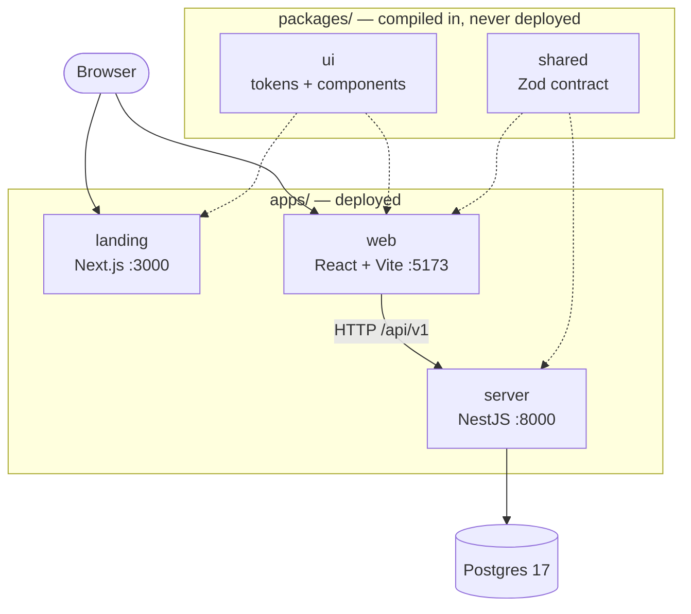
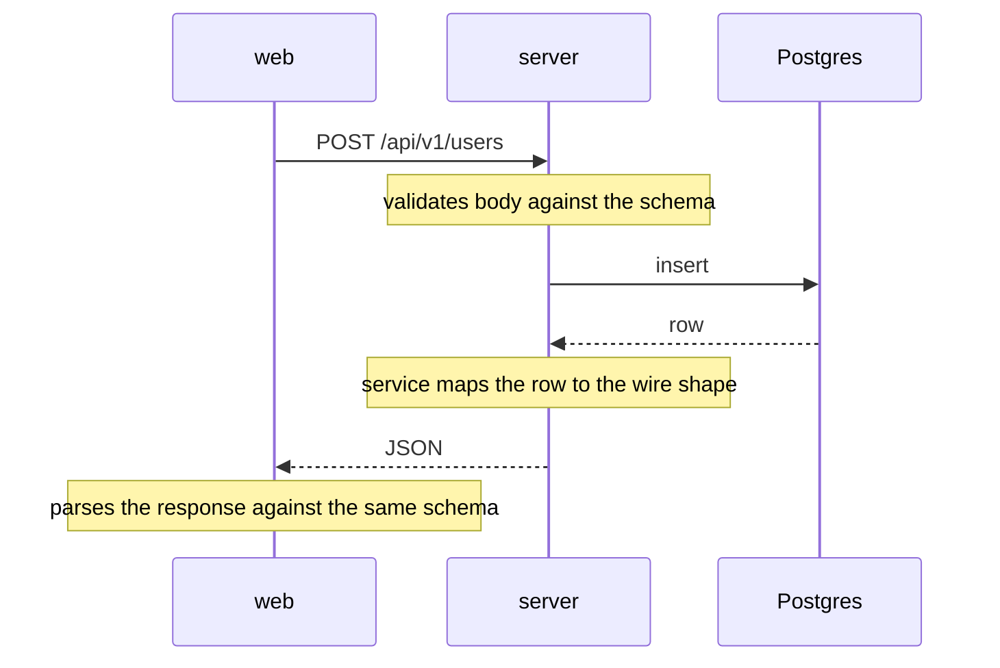

# high-level architecture

The shape of the system, before you pick a place to put something. For the exact
file layout see [file-structure.md](file-structure.md).

## What it is

A pnpm monorepo with three deployables and two shared packages, over one
Postgres database.



Solid arrows are runtime traffic. Dotted arrows are compile-time dependencies —
those packages are bundled into their consumers, never run on their own.

Two rules fall out of that picture and explain most of the setup:

- **Apps never import each other.** Anything two apps need becomes a package.
- **`server` never imports `ui`.** That one constraint is why `shared` compiles
  to JavaScript (the server runs plain Node) while `ui` ships raw TypeScript
  (only browser bundlers read it).

## Tech stack

Shared across everything: **TypeScript 6**, **Zod 4**, **pnpm 11** workspaces,
**Turborepo** for task running and caching, **oxlint** and **Prettier**, and
**Vitest 4** for tests.

| Package           | Built with                                                                     | Port |
| ----------------- | ------------------------------------------------------------------------------ | ---- |
| `apps/server`     | NestJS 12 (ESM), Drizzle ORM + postgres.js, Express                            | 8000 |
| `apps/web`        | React 19, Vite 8, React Router 8, Tailwind v4, axios                           | 5173 |
| `apps/landing`    | Next.js 16 (App Router), React 19, Tailwind v4 via PostCSS                     | 3000 |
| `packages/shared` | Zod only — no other runtime dependency                                         | —    |
| `packages/ui`     | Radix UI + shadcn/ui, Tailwind v4, CVA, Lucide icons, Geist font, Storybook 10 | 6006 |
| `db`              | PostgreSQL 17 (compose only)                                                   | 5432 |

A few choices worth knowing the reason for:

- **Zod on both sides.** It's the contract _and_ the runtime check. Zod 4
  implements Standard Schema, so its schemas plug straight into NestJS with no
  adapter.
- **Drizzle over a heavier ORM.** The schema is plain TypeScript, and migrations
  are generated by diffing it — no decorators, no separate modelling language.
- **Tailwind v4 with no config file.** The theme is CSS, which is why the same
  stylesheet works under Vite and PostCSS without either app declaring anything.
- **shadcn/ui vendored, not installed.** The components are ours to edit; there
  is no upstream package to upgrade.
- **Two frontends on purpose.** `landing` is public and static-friendly, so
  Next.js earns its keep there; `web` is behind a login one day and never needs
  SSR, so Vite stays faster.

## The central idea: one contract, checked at both ends

The repo's organizing bet is that **types span the whole stack, and are enforced
rather than assumed.** `packages/shared` holds one Zod schema per request and
response shape. Both ends import it; both ends check against it at runtime.



If either side drifts, the parse throws at the boundary — loudly, at the
failure, instead of quietly somewhere downstream.

There's no code generation. The contract is hand-written, which is what the
runtime checks pay for.

## Who owns what

| Layer          | Owns                         | Lives in                   |
| -------------- | ---------------------------- | -------------------------- |
| Drizzle schema | Storage — what the DB holds  | `apps/server/src/db/`      |
| The contract   | The wire — what crosses HTTP | `packages/shared/`         |
| The service    | The mapping between them     | `apps/server/src/modules/` |
| The tokens     | Every visual decision        | `packages/ui/src/tokens/`  |

None of these generates another. A column is not a field, and a color is not a
hex code in a component — both indirections are deliberate.

## Request path

One slice of the API is one folder. A request crosses three files:

```
HTTP → controller → service → Drizzle → Postgres
        (routes,     (logic,
         validation)  errors)
```

The controller validates and delegates. The service does the work and throws
HTTP exceptions. `/api/v1` comes from app-wide setup, not from any controller.

## Running it

`make up` starts `db`, `server` and `web` in Docker, in that order — `server`
waits for the database's healthcheck, `web` waits for `server`. `landing` isn't
in compose; run it with `pnpm --filter landing dev`.

One `.env` at the repo root configures all of it, and Turborepo orders the
tasks, so `shared` always builds before anything that imports it.

Ports, env vars and the other ways to run are in
[environments.md](environments.md).

## Where things are deliberately missing

- **No auth.** The client sends credentials and CORS allows them, but nothing
  issues or checks a session yet.
- **No server-state library** on the client. Calls go through a thin wrapper;
  caching is an open decision.
- **`mcp-app` and `mobile` are empty placeholders.**
- **No CI.** `.github/` exists and is empty.

## More

- [file-structure.md](file-structure.md) — every file, annotated
- [../guides/frontend.md](../guides/frontend.md) — how to build UI here
- [../guides/backend.md](../guides/backend.md) — how to build API code here
- [../../packages/README.md](../../packages/README.md) — the runtime boundary in detail
